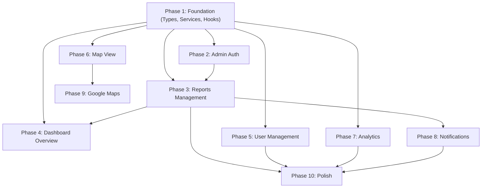

# Implementation Plan — AlertZone Admin Dashboard

> **⚠️ Agents**: Work through phases in order. Do NOT skip phases unless explicitly instructed. Update `CURRENT_STATUS.md` after completing each task.

---

## Phase 1: Foundation — Types, Constants & Service Layer 🏗️

**Goal**: Create the shared foundation (types, constants, services) that all dashboard features depend on. Replace wrong mock data types with correct ones matching the mobile app.

**Priority**: 🔴 CRITICAL — Must be done first.

### Task 1.1: Create TypeScript Types (matching mobile app)
- [ ] Create `lib/types/user.ts` — `UserProfile`, `UserStatus` (from mobile's `FIRESTORE_DATA_MODEL.md`)
- [ ] Create `lib/types/report.ts` — `Report`, `ReportStatus`, `ReportCategoryId`, `ReportLocation`, `StatusHistoryEntry`
- [ ] Create `lib/types/notification.ts` — `AppNotification`, `NotificationType`
- [ ] Create `lib/types/index.ts` — re-export all types
- [ ] Delete `app/data/mockData.ts` after types are migrated

### Task 1.2: Create Constants (matching mobile app)
- [ ] Create `lib/constants/categories.ts` — report categories with labels, icons, colors (from `MOBILE_APP_INTEGRATION_GUIDE.md` §6)
- [ ] Create `lib/constants/statuses.ts` — report statuses with labels, colors, icons (from `MOBILE_APP_INTEGRATION_GUIDE.md` §7)
- [ ] Create `lib/constants/colors.ts` — shared design system tokens (from mobile app's design system)
- [ ] Create `lib/constants/config.ts` — app-wide configuration values

### Task 1.3: Update Firebase Initialization
- [ ] Add Firebase Storage import to `lib/firebase.ts`
- [ ] Export `storage` alongside `auth` and `db`
- [ ] Remove `console.log` from production code
- [ ] Verify `.env.local` has correct Google Maps API key

### Task 1.4: Build Service Layer
- [ ] Create `lib/services/auth.service.ts`:
  - `loginAdmin(email, password)` — Firebase Auth + admin role verification
  - `logoutAdmin()` — sign out
  - `getCurrentAdmin()` — get current auth user
  - `isAdmin(uid)` — check if user has admin role in Firestore
- [ ] Create `lib/services/report.service.ts`:
  - `subscribeToReports(callback, filters?)` — real-time listener with filters
  - `getReportById(id)` — single report fetch
  - `updateReportStatus(reportId, newStatus, adminUid, note?)` — update status + create notification + append history
  - `assignReport(reportId, assigneeUid, adminUid)` — set assignedTo
  - `archiveReport(reportId, adminUid)` — set isArchived = true
  - `getReportStats()` — aggregated counts by status/category
- [ ] Create `lib/services/user.service.ts`:
  - `subscribeToUsers(callback)` — real-time listener
  - `getUserById(uid)` — single user fetch
  - `suspendUser(uid)` — set status = 'suspended'
  - `activateUser(uid)` — set status = 'active'
  - `getUserStats()` — total users, active, suspended counts
- [ ] Create `lib/services/notification.service.ts`:
  - `createStatusChangeNotification(report, previousStatus, newStatus)` — create notification for citizen
  - `createSystemNotification(recipientUid, title, body)` — system notification
  - `getNotificationStats()` — unread counts, recent notifications
- [ ] Create `lib/services/analytics.service.ts`:
  - `getReportsByDateRange(start, end)` — fetch for charts
  - `getReportsByCategory()` — category distribution
  - `getReportsByArea()` — area distribution
  - `getResolutionStats()` — resolution rate, avg time

### Task 1.5: Build Custom Hooks
- [ ] Create `lib/hooks/useAuth.ts` — auth state, login, logout, profile
- [ ] Create `lib/hooks/useReports.ts` — real-time reports with filters/pagination
- [ ] Create `lib/hooks/useUsers.ts` — real-time users
- [ ] Create `lib/hooks/useNotifications.ts` — notifications
- [ ] Create `lib/hooks/useAnalytics.ts` — dashboard stats & chart data
- [ ] Create `lib/hooks/useMapReports.ts` — map-specific report queries

### Task 1.6: Create Auth Context
- [ ] Create `lib/context/AuthContext.tsx`:
  - `AuthProvider` wrapper component
  - `useAuth()` hook exporting user, profile, isAdmin, loading, login, logout
  - Admin role verification on login
  - Session persistence with Firebase Auth's `onAuthStateChanged`
  - Auto-redirect to login if not authenticated

### Task 1.7: Commit & Verify
- [ ] Import new types across all components
- [ ] Verify `npm run dev` still works
- [ ] Commit: `feat: add types, services, hooks, and auth context`
- [ ] Update `CURRENT_STATUS.md`

---

## Phase 2: Admin Authentication 🔐

**Goal**: Replace fake login with real Firebase Auth + admin role verification.

**Priority**: 🔴 HIGH

### Task 2.1: Wire Admin Login
- [ ] Update `Adminlogin.tsx` to use `useAuth().login(email, password)`
- [ ] Remove `username` field (Firebase Auth uses email/password only)
- [ ] Add error handling with toast notifications
- [ ] Add loading state during auth
- [ ] Show error if user is not an admin or is suspended

### Task 2.2: Wire Auth Gate
- [ ] Update `app/page.tsx` to use `AuthProvider` and `useAuth()`
- [ ] Replace local `useState(false)` with auth context
- [ ] Add session persistence — don't lose login on page reload
- [ ] Show real admin name and role in dashboard topbar

### Task 2.3: Commit & Test
- [ ] Test: Login with non-admin account → should be denied
- [ ] Test: Login with admin account → should access dashboard
- [ ] Test: Page reload → should stay logged in
- [ ] Test: Logout → should redirect to login
- [ ] Commit: `feat: wire admin authentication with Firebase`

---

## Phase 3: Reports Management — Firestore Integration 📋

**Goal**: Replace all mock data in reports management with real Firestore data.

**Priority**: 🔴 HIGH

### Task 3.1: Wire Reports List
- [ ] Replace `MOCK_REPORTS` with `useReports()` hook
- [ ] Display real reports from Firestore with correct fields
- [ ] Wire filter tabs to Firestore queries (by status)
- [ ] Wire search to filter by title, ID, author name
- [ ] Wire category filter
- [ ] Add pagination (limit 50, load more)
- [ ] Show loading skeleton while data loads

### Task 3.2: Wire Report Detail
- [ ] Show full report detail with real data
- [ ] Display report images from Firebase Storage URLs
- [ ] Show status timeline from `statusHistory` array
- [ ] Show location on mini Leaflet map
- [ ] Show reporter info from denormalized fields

### Task 3.3: Wire Status Updates
- [ ] Add status change dropdown/buttons (PENDING → ASSIGNED → FIXING → RESOLVED / REJECTED)
- [ ] Call `report.service.ts` `updateReportStatus()`
- [ ] Automatically create notification for citizen on status change
- [ ] Append to `statusHistory` with admin UID, timestamp, and optional note
- [ ] Add confirmation dialog for status changes
- [ ] Handle RESOLVED: prompt for resolution note, increment citizen's `reportsValidated` + contribution points
- [ ] Handle REJECTED: require rejection reason

### Task 3.4: Wire Report Assignment
- [ ] Add "Assign To" field
- [ ] Update `assignedTo` field in Firestore
- [ ] Append to `statusHistory`

### Task 3.5: Wire Report Archival
- [ ] Add "Archive" button
- [ ] Set `isArchived = true` in Firestore
- [ ] Filter out archived reports by default
- [ ] Add "Show Archived" toggle

### Task 3.6: Commit & Test
- [ ] Test: View real reports from Firestore
- [ ] Test: Change status → verify mobile app shows updated status
- [ ] Test: Change status → verify notification created in Firestore
- [ ] Test: Archive report → verify it's hidden
- [ ] Commit: `feat: wire reports management to Firestore`

---

## Phase 4: Dashboard Overview — Live Data 📊

**Goal**: Replace hardcoded dashboard stats and charts with real Firestore data.

**Priority**: 🟡 MEDIUM

### Task 4.1: Wire Stat Cards
- [ ] Total Reports — count from Firestore
- [ ] Pending/Reported — count where `status === 'PENDING'`
- [ ] In Progress — count where `status === 'ASSIGNED' || status === 'FIXING'`
- [ ] Resolved — count where `status === 'RESOLVED'`
- [ ] Closed/Archived — count where `isArchived === true`
- [ ] Calculate trends (vs. previous period)

### Task 4.2: Wire Charts
- [ ] Donut chart — real status distribution
- [ ] Bar chart — real category distribution
- [ ] Line chart — real monthly trend data
- [ ] Recent reports table — real latest reports

### Task 4.3: Commit & Test
- [ ] Verify dashboard loads with real data
- [ ] Commit: `feat: wire dashboard overview to Firestore`

---

## Phase 5: User Management — Firestore Integration 👥

**Goal**: Display and manage real user accounts from Firestore.

**Priority**: 🟡 MEDIUM

### Task 5.1: Wire Users List
- [ ] Replace mock users with `useUsers()` hook
- [ ] Display real user data with correct fields (name, email, area, reports count, points, level, status)
- [ ] Wire search to filter by name, email
- [ ] Wire status filter (active, suspended)
- [ ] Wire role filter (citizen, admin)

### Task 5.2: Wire User Actions
- [ ] Add Suspend/Activate toggle
- [ ] Call `user.service.ts` `suspendUser()` / `activateUser()`
- [ ] Add confirmation dialog
- [ ] Show user detail with full profile info

### Task 5.3: Commit & Test
- [ ] Test: View real users from Firestore
- [ ] Test: Suspend user → verify status changes
- [ ] Commit: `feat: wire user management to Firestore`

---

## Phase 6: Map View — Live Report Pins 🗺️

**Goal**: Display real report locations on the Leaflet map.

**Priority**: 🟡 MEDIUM

### Task 6.1: Wire Map Data
- [ ] Fetch report locations from Firestore
- [ ] Display color-coded pins by status
- [ ] Add category-based pin colors
- [ ] Wire filter chips (by status, category)

### Task 6.2: Wire Map Interactions
- [ ] Click pin → show report detail popup
- [ ] Add marker clustering for dense areas
- [ ] Center map on Sri Lanka by default
- [ ] Add search to jump to location

### Task 6.3: Commit & Test
- [ ] Test: Map shows real report pins
- [ ] Test: Clicking pin shows report detail
- [ ] Commit: `feat: wire map view to Firestore`

---

## Phase 7: Analytics — Real Data Charts 📈

**Goal**: Replace hardcoded analytics with real Firestore data aggregation.

**Priority**: 🟡 MEDIUM

### Task 7.1: Wire Analytics Data
- [ ] Reports over time (daily/weekly/monthly line chart)
- [ ] Category distribution (bar chart)
- [ ] Status distribution (pie/donut chart)
- [ ] Area distribution (table or heatmap)
- [ ] Resolution rate (% resolved / total)
- [ ] Average resolution time

### Task 7.2: Wire Filters
- [ ] Date range picker
- [ ] Category filter
- [ ] Area filter
- [ ] Export data option

### Task 7.3: Commit & Test
- [ ] Verify charts render with real data
- [ ] Commit: `feat: wire analytics to Firestore`

---

## Phase 8: Notifications System 🔔

**Goal**: Full notification management — create, view, and deliver notifications.

**Priority**: 🟡 MEDIUM

### Task 8.1: In-App Notifications
- [ ] Display real notifications from Firestore
- [ ] Wire notification bell badge to unread count
- [ ] Mark as read functionality
- [ ] Create system-wide notifications

### Task 8.2: Status Change Notifications
- [ ] Automatically create Firestore notification when admin changes report status
- [ ] Include report details (title, new status) in notification body
- [ ] Include `reportId` for mobile app deep-linking

### Task 8.3: (Future) Push Notifications via FCM
- [ ] Set up Firebase Cloud Functions
- [ ] Listen to `notifications` collection writes
- [ ] Send FCM push to citizen's device using `fcmToken` from user doc
- [ ] Handle notification tap → open report in mobile app

### Task 8.4: Commit & Test
- [ ] Test: Change report status → notification appears in Firestore
- [ ] Test: Mobile app shows notification in notification center
- [ ] Commit: `feat: implement notification system`

---

## Phase 9: Google Maps Integration 🌍

**Goal**: Add Google Maps support alongside Leaflet for enhanced map features.

**Priority**: 🟢 LOW

### Task 9.1: Setup
- [ ] Add Google Maps API key to `.env.local` (`NEXT_PUBLIC_GOOGLE_MAPS_API_KEY`)
- [ ] Install `@react-google-maps/api` or use Google Maps JS API directly
- [ ] Consider keeping Leaflet as primary (free, no API key limits)

### Task 9.2: Enhanced Map Features
- [ ] Street View integration
- [ ] Satellite view toggle
- [ ] Better geocoding support
- [ ] Directions to report location

---

## Phase 10: Polish & Production Readiness 🔒

**Goal**: Secure, optimize, and prepare for deployment.

**Priority**: 🟡 MEDIUM (after all features)

### Task 10.1: Security
- [ ] Firestore security rules — admin-only write for status, reports, notifications
- [ ] Rate limiting
- [ ] Input validation on all forms
- [ ] Remove test pages (`test-connection/`)

### Task 10.2: Performance
- [ ] Pagination for large lists
- [ ] Optimize Firestore queries with indexes
- [ ] Image lazy loading for report photos
- [ ] Bundle analysis and code splitting

### Task 10.3: UX Polish
- [ ] Loading skeletons on all data-driven components
- [ ] Error boundary components
- [ ] Empty state designs
- [ ] Toast notification system for success/error feedback
- [ ] Keyboard shortcuts (⌘K search, etc.)

---

## Phase Dependencies

---

## Effort Estimates

| Phase | Estimated Effort | Complexity |
|---|---|---|
| Phase 1: Foundation | 4-6 hours | Medium (types + services setup) |
| Phase 2: Admin Auth | 2-3 hours | Low-Medium |
| Phase 3: Reports Management | 8-12 hours | High (core feature, notifications) |
| Phase 4: Dashboard Overview | 4-6 hours | Medium (aggregation queries) |
| Phase 5: User Management | 3-4 hours | Low-Medium |
| Phase 6: Map View | 4-6 hours | Medium |
| Phase 7: Analytics | 6-8 hours | Medium-High |
| Phase 8: Notifications | 6-8 hours | High (FCM + Cloud Functions) |
| Phase 9: Google Maps | 3-4 hours | Medium |
| Phase 10: Polish | 4-6 hours | Medium |

**Total Estimated: 44-63 hours**
